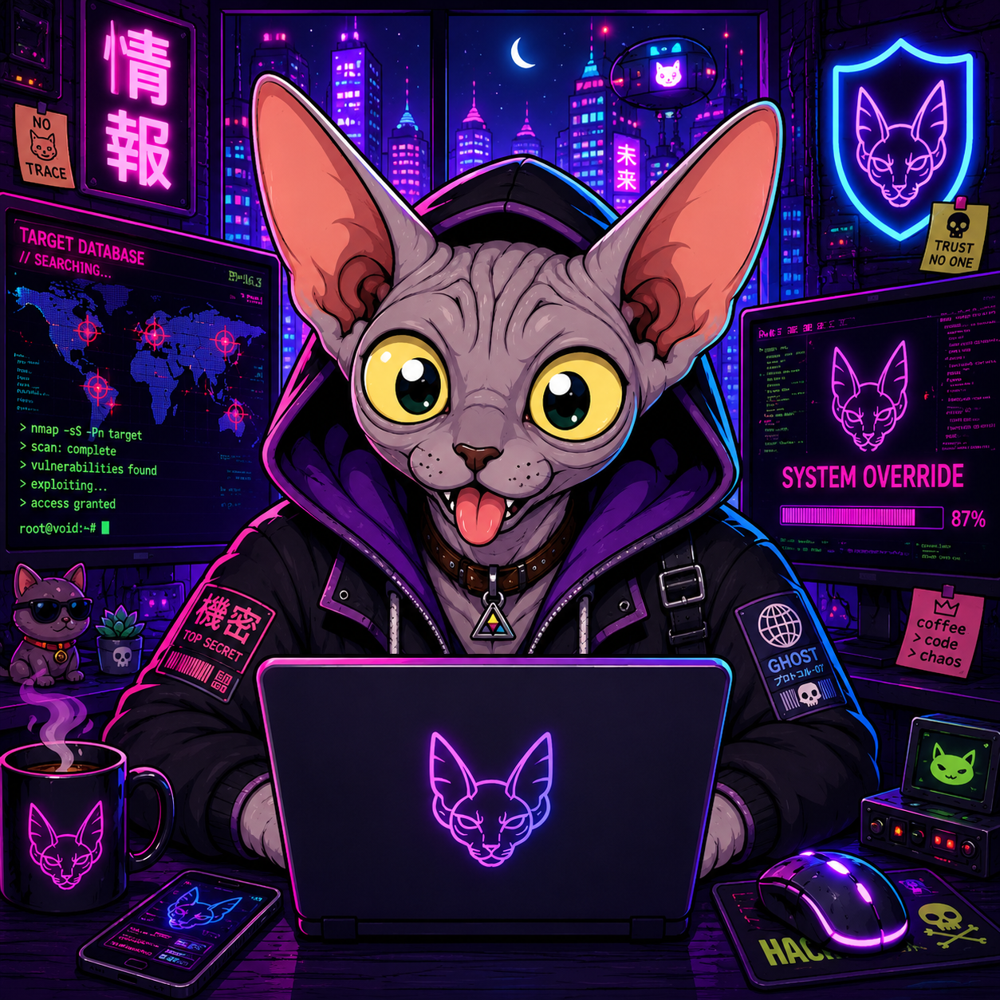

<p align="center">
  
</p>

# Cat Bot

A self-hosted Discord bot about catching cats. Spawns appear in setupped channels, players type `cat` to catch, per-server profiles track everything else (packs, the mafia, the catstore, the casino, achievements, a fake stock market, and so on).

## What's different from upstream

| Area | Upstream | This fork |
|---|---|---|
| Voting | `/vote` earns rain minutes, drives streak counter | Voting retired (`voting_enabled=0`), streak renamed to `daily_catch_streak` and tracks per-day catches |
| Wallet | Two silos, "cat dollars" for /roulette and "coins" for /stocks and /packs | One `coins` wallet shared across /stocks, /packs, /roulette, /catstore, /catslots |
| Marketplace | None | `/catstore` sells discovered cat rarities, plus an Extras sub-tree for paid rain blocks and Stone-through-Celestial packs |
| PvE | None | `/jobs` Mafia Killings, six NPCs, deterministic 6h contract windows, complications, job perks, daily commit cap, once-per-season Big Score, paid board reroll (level-scaled coin cost, escalates within the 12h window; also available via `/catstore`) |
| Mafia decay | None | **Respect** meter (0..100) ticks down 1/hr while idle, refills from job completions. At zero, catnip_level drops one per 6 zero-hours (floored at Lv4) along with its store discount. |
| Top-tier prices | Pre-rebalance Celestial = 3k coins, eGirl = ~4k | Celestial 21k (7×), Diamond 9k (5×), Platinum 4.8k (4×), Gold 1.8k (3×), Silver 600 (2×). Cat tier multipliers: Mythic 1.5×, Divine 4×, Real 5×, Ultimate 6×, eGirl 7×. Low-tier prices unchanged. |
| Prism crafting | One of every cat type, no coin cost | Cat recipe unchanged, plus a per-profile coin tax: **5k × 2^N** for your Nth prism on this server, capped at 320k. |
| Slots | `/slots` 3-reel | `/slots` plus `/catslots` 5×3 Vegas-style with 20 paylines and a per-line cap |
| Stock market | Static order book at the initial price | Bot-owned market maker ticks prices off in-game metrics (prism count, active catnip, average battlepass level, etc.) |
| Catnip perks | Time Manipulator and the legacy lineup | Snowballer, Battlepass Booster, Bait & Switch added. Time Manipulator removed entirely (migration 020 remaps stored perk indices). Voting Booster renamed to Loyalty Streak |
| Catnip session length | Scales with level | Always 24h regardless of level |
| Battlepass quest slots | 4 (vote, catch, misc, extra) | 5, with a new `challenge` slot for harder catch-condition quests |
| Passive XP | None | XP drips on first catch of the UTC day, every 10-catch streak, every catnip level-up, and for prism owners when their prism boosts someone else's catch |
| Sub-1 pack fail | Always 3 Fine cats | Cascades to a tier-lower pack first, with a 3-Fine-cat floor |
| Profile card | None | `/catprofile [user]` shows a compact at-a-glance embed: mafia level/rank, cattlepass progress, cat count and collection value, prisms, coins, achievements, catch streak, pig high score, and cookies. Supports viewing other players. |
| Season warning + recap | None | Bot posts a "season ends tomorrow" embed to every setupped channel on the last day of the month, listing what the reset wipes vs keeps. On the 1st it follows up with a per-server season recap leaderboard (top coins earned, roulette, stocks). Per-server opt-out via `/settings` (`server.season_announcements`). |

Design docs for each system live in `docs/design/`.

## Development

> Self-hosting is hacky. Expect to edit code.

Prereqs: Python 3.13+, PostgreSQL 17 (or `setup-pg.sh` for podman), a [Discord bot token](https://discord.com/developers/applications).

```bash
git clone https://github.com/sneezeparty/catbot7.git
cd catbot7
python -m venv venv && source venv/bin/activate
pip install -r requirements.txt    # or requirements-gw.txt for the gateway-proxy build
```

Upload the [Cat Bot emoji pack](https://github.com/staring-cat/emojis/releases/latest/download/emojis.zip) to your application's **App Emojis** in the Discord Developer Portal.

Bring up Postgres. Either native (create user `cat_bot` and database `cat_bot`, then `psql -U cat_bot -d cat_bot -f schema.sql`), or run `bash setup-pg.sh` after editing `PGPASS` inside it. The script starts Postgres 17 in podman on `127.0.0.1:5433` and applies the schema.

Set env vars, then run `python bot.py`.

### Env vars (read in `config.py`)

| Variable | Required | Purpose |
|---|---|---|
| `TOKEN` | **yes** | Discord bot token |
| `psql_password` | **yes** | DB password |
| `psql_host` | default `127.0.0.1` | DB host |
| `psql_port` | default `5432` | DB port. Set `5433` if using `setup-pg.sh` |
| `sentry_dsn` | no | Sentry DSN for error reporting |
| `webhook_verify` | no | top.gg vote webhook secret (dormant, voting retired). Without it the public aiohttp server on `0.0.0.0:8069` is not started |
| `top_gg_modern_token` | no | top.gg v1 API token (dormant) |
| `wordnik_api_key` | no | `/define`. Without it the command is unregistered and its battlepass quest is auto-skipped |
| `backup_channel_id` | no | DB backup channel ID |
| `donor_channel_id` | no | supporter images channel ID |
| `rain_channel_id` | no | rain log channel ID |
| `voting_enabled` | default `0` | re-enable the retired voting path. `daily_catch_streak` drives gameplay regardless |
| `store_enabled` | default `0` | enable the `/store` slash command, entitlement event handlers, and the startup reconciliation pass. SKUs live in `config/store.json` |
| `support_invite` | default empty | invite to your support / community Discord. Used wherever the upstream bot used to link to its own server. Empty means the link is omitted entirely |

Tip: append `export VAR=value` lines to `venv/bin/activate` so they are set whenever the venv is active.

## Admin webui

If the bot is running, browse `http://127.0.0.1:9445`. It is **localhost-only and unauthenticated**, so never expose it. The webui edits live game state and JSON configs.

## Cat Bot Store

This fork ships its own optional `/store` command backed by **Discord's native monetization system** (SKUs and entitlements). The fork is not affiliated with the upstream bot's store. To enable it: set `store_enabled=1`, create your SKUs in the Discord Developer Portal under **Monetization**, then paste their numeric ids into `config/store.json` with a `kind` of `supporter` (grants `user.premium`) or `cosmetic` (recorded without changing premium). Discord handles checkout. The bot reconciles entitlement state on every startup so changes that happen offline are not lost.

## Migrations

Standalone scripts in `migrations/`. They expect the bot to be stopped, read the same env vars as `bot.py`, are idempotent via a `NNN.done` marker, and append output to `NNN.log`. Delete the marker to re-run.

A fresh `schema.sql` already includes every column, so migrations only matter when upgrading an existing database that predates a feature.

| # | What it does |
|---|---|
| 001 | Backfill `profile.unlocked_aches` JSONB from the legacy per-ach boolean columns |
| 002 | Add `profile.combo_stack` (Snowballer perk state) |
| 003 | Add the 5th `challenge` battlepass quest slot |
| 004 | Rename `vote_streak` to `daily_catch_streak`, `max_vote_streak` to `max_daily_streak` |
| 005 | Add `discovered_cats` and `store_purchased_rarities` for Cat Store, backfill discovery |
| 006 | Merge `roulette_balance` into `coins` and drop the column |
| 007 | Jobs foundation, 16 profile columns plus `jobinstance` table and 2 indexes |
| 008 | `perks_suspended_until` for the Cat Police pinch |
| 009 | Job complications, `jobs_pending_difficulty_mult`, `jobs_pending_heat_bonus`, `jobinstance.complication` |
| 010 | Job perks, `profile.job_perks` JSONB |
| 011 | `profile.perks_received` JSONB (lifetime distinct perk IDs for the Mafia Favors leaderboard) |
| 012 | Move job perk roll to offer-generation, `jobinstance.perk_drop` |
| 013 | `/catslots` state, 5 counter columns plus 4 ach booleans |
| 014 | Rain in catstore, `rain_blocks_bought_today` and `rain_blocks_last_date` |
| 015 | Packs in catstore, `store_purchased_pack_tiers` JSONB |
| 016 | `/catslots` eGirl bonus round counters and ach booleans |
| 017 | Cat Bot Store, `user.entitlements` JSONB |
| 018 | Respect meter (`profile.respect`, `respect_last_tick`) + prism craft counter (`profile.prisms_crafted`). Backfills the counter from existing prism rows. |
| 019 | `profile.season_reset_pending` flag for the one-shot "your season just reset" notice. |
| 020 | Removes the `timer_add` "Time Manipulator" catnip perk and remaps stored perk indices ≥ 12 down by one across `profile.perks`/`perk1`/`perk2`/`perk3`. |
| 021 | Add `server.season_announcements BOOLEAN DEFAULT true` (per-server opt-out for the season-end warning). No backfill needed. Safe to re-run. |
| 022 | Add six `profile` columns for the season-recap leaderboard: `coins_earned`, `roulette_coins_won`, `roulette_coins_bet`, `stock_coins_earned`, `stock_coins_spent` (all `bigint DEFAULT 0`) and `season_stat_baseline` (`jsonb DEFAULT '{}'`). No backfill needed — defaults are correct for all existing rows. Safe to re-run. |
| 023 | Add `profile.job_rerolls_window` (`integer DEFAULT 0`) and `profile.job_rerolls_window_idx` (`bigint DEFAULT 0`) for the paid `/jobs` board reroll price-escalation counter. No backfill needed. Idempotent (per-column gated). Bot must be stopped before running. |

Run in numeric order. Each script is idempotent via its `.done` marker. Most are also safe to re-run after deleting the marker — **except `020`, which mutates data in place** and would double-remap if re-run; restore the pre-migration data before re-running it.

## License

Cat Bot is licensed under the GNU Affero General Public License v3.0. See `LICENSE`. AGPL means deployment changes must be published, so if you run a public instance, the source corresponding to what you deploy needs to stay public.

`catpg.py`, the custom `asyncpg` wrapper, is licensed under MIT. License text is at the top of that file.

This codebase is a snapshot fork of [milenakos/cat-bot](https://github.com/milenakos/cat-bot) (the public Cat Bot on Discord, [top.gg listing](https://top.gg/bot/966695034340663367), [wiki](https://wiki.minkos.lol)). Original copyright headers are preserved in source files per AGPL.
